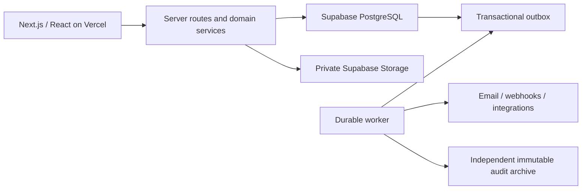
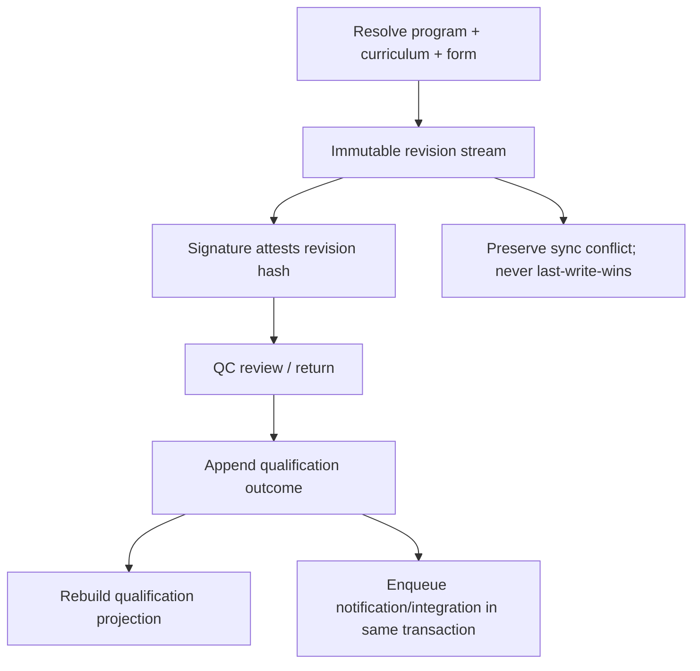

# ATQ architecture

## Status

This document describes the proof-of-concept foundation, not an authorization to store operational training records. All repository fixtures are synthetic. Controlled curricula, forms, task mappings, signature policy, retention rules, and source-of-record decisions must be approved before production use.

## Architectural commitments

1. **Resolve the governing program first.** A person, event, form, or qualification calculation cannot proceed until the resolver identifies N&O or AQP, the effective curriculum version, and the form binding.
2. **Preserve history rather than overwrite it.** Policy and identity data carries both business-effective time and system-recorded time. Signed artifacts and qualification outcomes are append-only evidence.
3. **Keep projections disposable.** `app.qualification_projections` is a rebuildable read model. `app.qualification_outcome_events`, signed revisions, and their audit chain are the evidence.
4. **Use internal immutable UUIDs.** Integration identifiers are attributes with uniqueness constraints. In particular, `app.tasks.id` is the internal key and `app.tasks.vision_task_id` is the unique Vision contract.
5. **Keep infrastructure replaceable.** Domain code does not import Supabase. Database migrations are ordinary PostgreSQL, with Supabase-only storage policy creation guarded by schema-existence checks.
6. **Fail closed.** RLS is enabled on every application, audit, and integration table before policies are added. An omitted table has no accessible rows.

## Runtime topology



The browser receives only the Supabase anonymous key. The service-role key is server-only and must never be prefixed with `NEXT_PUBLIC_`. Privileged mutations should run through server endpoints or narrowly scoped database functions that validate authorization, append evidence, and enqueue downstream work in one transaction.

## Database organization

| Schema        | Purpose                                   | Representative tables                                                                            |
| ------------- | ----------------------------------------- | ------------------------------------------------------------------------------------------------ |
| `app`         | Regulatory and operational domain         | people, positions, programs, curricula, tasks, forms, events, grades, signatures, qualifications |
| `audit`       | Append-only change and access evidence    | `audit_events`, `access_events`                                                                  |
| `integration` | Reliable side effects and synchronization | `outbox_messages`, `background_jobs`, `integration_sync_runs`                                    |
| `storage`     | Supabase-managed object metadata          | private `atq-records` and `atq-evidence` buckets                                                 |

The initial migration set is:

1. `202607300001_core.sql` — organization, identities, bitemporal people/positions, programs, MATS, curricula, tasks, form versions/bindings, and resolution logs.
2. `202607300002_operations.sql` — events, participants, form evidence, attempts/grades/signatures, qualifications, notifications, no-notice, Special Tracking/TRB, retention, outbox, jobs, and audit tables.
3. `202607300003_security_and_delivery.sql` — permissions, roles, RLS, immutable triggers, hash-chained audit events, outbox worker functions, and guarded Storage policies.
4. `202607300004_auth_scope_and_evidence_hardening.sql` — strict scoped authorization, tenant-bound roles, retained evidence, protected Storage mutation, and approved Auth invitation mapping.
5. `seed.sql` — clearly labeled synthetic B747 AQP/N&O demonstration data.

PostgreSQL 15 or later is required because the schema uses `UNIQUE NULLS NOT DISTINCT`. Required extensions are `pgcrypto` and `btree_gist`.

## Time and version semantics

Configuration and person records use:

- `valid_from` / `valid_to`: when the fact is true in the business domain, represented as a half-open `[from, to)` period.
- `recorded_at` / `superseded_at`: when ATQ knew that version, also represented as a half-open period.
- `as_known_at`: the resolver's system-time watermark.

Current versions have `superseded_at IS NULL`. Corrections create a new version and close the prior system-time interval. They do not rewrite history. Exclusion constraints prevent two current revisions of the same stable entity from claiming overlapping effective periods.

Operational form edits use immutable numbered `form_instance_revisions`, not bitemporal rows. Every submission stores:

- the filled payload;
- the form schema snapshot;
- the program/curriculum snapshot;
- the authorization decision snapshot;
- a content hash;
- client and server timestamps; and
- an idempotency key.

Grades point to both an immutable attempt and immutable form revision. Signatures attest the exact revision hash. Revocation is a separate `signature_revocations` event. Amendments create a new revision and a linked amendment record.

## Program resolution

`src/lib/domain/program-resolution.ts` is a pure deterministic resolver. Its decision order is:

1. validate the full input and date semantics;
2. use a valid, approved, person-specific override when present;
3. otherwise select the effective implemented MATS transition for the fleet, seat, and curriculum type;
4. use class start for Qualification/Indoctrination and CQ cycle commencement for CQ;
5. apply any explicit individual AQP-entry eligibility date;
6. select exactly one effective approved/published curriculum;
7. select the unique highest-priority form binding for program, fleet, seat, curriculum, event type, and event reason.

Missing Qualification/Indoctrination class start is an error. Missing CQ commencement falls back to event date only with a `needs_review` result. Conflicting overrides, transitions, curricula, or form bindings never resolve silently.

The caller persists the complete input, reasoning chain, catalog watermark, resolver version, and a SHA-256 hash of `canonicalDecisionKey` in `app.program_resolution_log`. A UI must show the reasoning chain wherever the program changes vocabulary, forms, or due-date rules.

## Form and qualification lifecycle



The `form_instances.current_state` column is a queue projection. `form_instance_state_events` is the lifecycle evidence. Signed data is never edited in place; QC returns and amendments append revisions.

Offline clients generate stable UUID idempotency keys for the form instance, every revision, every state transition, and every signature. Server unique constraints turn retries into safe replays. A synchronization conflict enters `sync_conflict` and preserves both payloads for reconciliation.

## Authorization and sensitive partitions

Authentication and authorization are separate:

- `app.user_profiles` maps an identity-provider subject to an internal user UUID.
- roles contain permissions;
- time-boxed role assignments contain optional fleet/base/program scopes;
- RLS evaluates the current identity for every table access.

Exactly `{}` means organization-wide. A scoped assignment uses one or more non-empty UUID arrays:

```json
{
    "fleet_ids": ["12000000-0000-4000-8000-000000000001"],
    "base_ids": ["13000000-0000-4000-8000-000000000002"]
}
```

Absent dimensions are unrestricted; present dimensions must match the row. Empty arrays, unknown keys, malformed UUIDs, and cross-organization user/role/delegator combinations are rejected. Security administration, audit, integrations, notifications, and organization-wide configuration intentionally require global assignments when their rows cannot be safely reduced to a fleet/base/program.

Sensitive records are physically separated:

- medical/credential/HR person data: `person_sensitive_profiles`;
- covert targets: `no_notice_assignments`;
- Special Tracking/TRB: `special_tracking_*` and `trb_*`;
- employment disposition: `trb_hr_dispositions`.

Normal record access cannot read covert event-version rows. The service-role credential bypasses RLS and is therefore reserved for reviewed server workflows. It is not a substitute for authorization logic.

### Approved Supabase user provisioning

Public signup remains disabled. An `auth.users` row grants no ATQ access by itself:

The first administrator is an explicit operator bootstrap. Before creating the Auth identity, a database owner in the Supabase SQL editor or a trusted server holding the service-role key calls `app.bootstrap_first_security_admin_invitation`. `anon` and `authenticated` cannot execute this function. It accepts only a same-organization role that already grants `security:admin`, serializes concurrent attempts, and refuses an organization that has an administrator assignment or any prior operator-bootstrap request.

```sql
select app.bootstrap_first_security_admin_invitation(
  '10000000-0000-4000-8000-000000000001'::uuid,
  'first.admin@example.invalid',
  'First Administrator',
  '61000000-0000-4000-8000-000000000001'::uuid,
  '{}'::jsonb,
  statement_timestamp() + interval '48 hours',
  'OPERATOR-CHANGE-REFERENCE'
);
```

Only after that transaction commits does the operator call Supabase Admin `inviteUserByEmail`. If the one-time request is incorrect or expires, a database operator must review the audit record and repair that existing request; the bootstrap function cannot be run a second time for the organization. The service-role key and this RPC must never be exposed to a browser.

After the first administrator is mapped:

1. An active `security:admin` calls `app.approve_user_invitation` with organization, email, display name, a same-organization role, validated scope, expiration, and approval reference.
2. Only after that succeeds, the server calls Supabase Admin `inviteUserByEmail` with the server-only service-role key.
3. The guarded `auth.users` trigger consumes only an approved, unexpired request and creates `app.user_profiles` plus its tenant-bound role assignment. User-controlled Auth metadata never supplies organization, role, scope, or display name.
4. The profile remains `invited` until `email_confirmed_at` is set. Only an `active` profile resolves through `app.current_user_id`.
5. An unapproved Auth identity receives no application profile, so all ATQ RLS policies deny it.

Example approval:

```sql
select app.approve_user_invitation(
  '10000000-0000-4000-8000-000000000001'::uuid,
  'approved.user@example.invalid',
  'Approved User',
  '61000000-0000-4000-8000-000000000003'::uuid,
  '{"fleet_ids":["12000000-0000-4000-8000-000000000001"]}'::jsonb,
  statement_timestamp() + interval '48 hours',
  'ACCESS-APPROVAL-REFERENCE'
);
```

If an Auth row predates approval, it is deliberately not backfilled. After independently verifying both records, a service-role workflow may call `app.consume_approved_supabase_invitation(auth_subject, email, confirmed)`. Provisioning requests, profiles, and role assignments are audited.

Storage keys follow:

```text
<organization-uuid>/<classification>/<entity-uuid>/<immutable-file-name>
```

Classifications are `records`, `sensitive`, `no-notice`, `special-tracking`, and `audit`. Storage RLS verifies both the organization path segment and the corresponding permission. Signed evidence uses content-addressed or otherwise immutable keys; replacing an object at the same key is prohibited by application workflow.

Once registered in `record_attachments`, metadata and the Storage object cannot be changed or deleted. The entire `atq-evidence` bucket is append-only to authenticated users. Scan results, legal holds, retention extensions, and disposition facts append `record_attachment_events` and require `records:evidence:write`. Only finalized amendments enter `form_amendments`; requests remain workflow/state events until approval.

## Audit and reliable delivery

`audit.append_event` serializes each organization's inserts with a transaction advisory lock and chains SHA-256 hashes. Direct update/delete attempts on audit and critical evidence tables are rejected. The database chain detects tampering; a separately retained immutable copy detects deletion or wholesale chain replacement.

Downstream actions use `integration.outbox_messages`:

1. mutate domain evidence;
2. insert the outbox message with the same transaction and idempotency key;
3. commit;
4. workers claim rows with `FOR UPDATE SKIP LOCKED`;
5. deliver idempotently;
6. mark delivered, retry with backoff, or dead-letter.

`app.record_qualification_outcome_and_enqueue` is the reference atomic-write path: it verifies `qualification:write`, deduplicates the outcome, rejects reuse of an idempotency key with different content, and enqueues the matching integration event before the transaction commits.

Notification delivery does not control the effective time of a regulatory action. For example, a base-month change can be effective while its notification independently shows overdue/failed delivery.

## Provisional source-of-record boundaries

These assumptions permit a proof of concept but require business approval:

| Entity                                    | POC posture                                                                                        |
| ----------------------------------------- | -------------------------------------------------------------------------------------------------- |
| Vision tasks/TPOs/SPOs                    | Vision owns external task identity and revisions; ATQ mirrors and references them                  |
| HR identity, employment, base, position   | HRIS is authoritative; ATQ retains effective-dated synchronized history                            |
| Operational schedule/roster               | Crew scheduling/AIMS is authoritative during transition                                            |
| Form runtime and signed training evidence | ATQ owns only synthetic POC records until the Comply365/AIMS boundary is approved                  |
| Qualification truth                       | ATQ computes a projection; outbound publication remains disabled until the owning system is chosen |
| Notifications                             | ATQ owns delivery evidence for notifications it initiates                                          |

Every inbound row records source system, external identifier, recorded time, and source payload/provenance where applicable. Reconciliation failures enter a hold state rather than being silently corrected.

## Production gates

Before non-synthetic records:

- approve controlled program/curriculum/form content and the current MATS;
- approve electronic signature and offline contingency policy;
- establish Atlas Entra SSO/MFA and managed-device controls;
- finish source-of-record and data-flow ownership decisions;
- validate RLS with role/scoping integration tests;
- add independently retained database and object backups for at least the approved retention period;
- complete restore, tamper-evidence, offline-conflict, idempotency, and disaster-recovery exercises;
- obtain privacy, labor, records, legal, cybersecurity, and FAA compliance approval.
