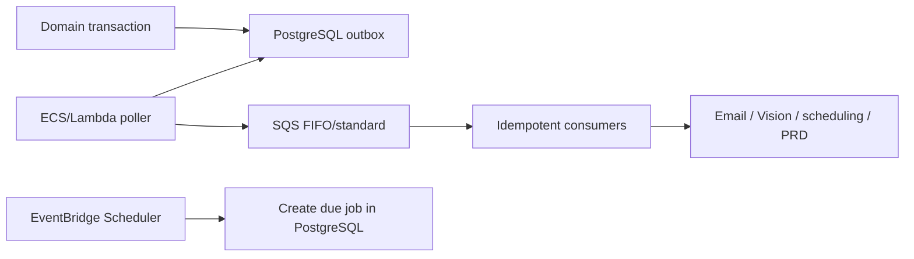

# Supabase-to-AWS migration plan

## Goal

The proof of concept runs on Vercel and Supabase while keeping the regulatory domain portable to AWS. Migration should change infrastructure adapters, not entity identities, historical semantics, signed hashes, or resolver outcomes.

## Service mapping

| Current POC service              | AWS target                                       | Portability boundary                                                                    |
| -------------------------------- | ------------------------------------------------ | --------------------------------------------------------------------------------------- |
| Supabase PostgreSQL              | Aurora PostgreSQL or RDS PostgreSQL              | Plain SQL migrations; PostgreSQL 15+; `pgcrypto` and `btree_gist`                       |
| Supabase Auth federated to Entra | Cognito federated to Entra, or direct Entra OIDC | `app.user_profiles.id` remains stable; provider subjects are mappings                   |
| Supabase Storage                 | S3                                               | Stable object keys, byte size, media type, and SHA-256 retained in `record_attachments` |
| Database outbox worker           | ECS/Fargate or Lambda worker                     | `integration.outbox_messages` stays the source queue                                    |
| Supabase/Vercel invocation       | SQS + EventBridge Scheduler                      | Idempotency keys and dead-letter policy are domain contracts                            |
| Supabase Realtime, if introduced | API Gateway WebSocket/AppSync or polling         | Do not make realtime delivery authoritative                                             |
| Vercel Next.js                   | Amplify, ECS/Fargate, or continued Vercel        | Domain packages and server APIs remain platform-neutral                                 |
| Independent audit export         | S3 Object Lock (compliance mode where approved)  | Preserve chain order, hashes, metadata, and signed manifests                            |

Aurora versus RDS is an operational choice. Validate workload, failover behavior, extension availability, cost, and restore testing before selecting. Do not change PostgreSQL semantics merely to use a proprietary database feature.

## Portability controls already in the schema

- No foreign key targets `auth.users`.
- Identity-provider subjects are attributes on internal user profiles.
- UUID primary keys do not depend on Supabase sequences.
- Vision task numbers are immutable unique external identities.
- Supabase Storage objects are referenced by bucket/key and hash; domain records do not reference `storage.objects`.
- Supabase-specific Storage policy creation is guarded and becomes a no-op when the `storage` schema is absent.
- Supabase JWT behavior is isolated in `app.current_auth_subject()`.
- Jobs and notifications are durable database records, not Vercel Cron state.
- The resolver is pure TypeScript with no vendor SDK imports.

## Identity migration

1. Configure Entra federation in the chosen AWS identity service.
2. Preserve every `app.user_profiles.id`.
3. Replace the guarded Supabase `auth.users` trigger with an equivalent approved-invitation consumer. Preserve `user_provisioning_requests`, including the operator-only, one-time first-administrator bootstrap distinction; never derive organization, role, or scope from user-controlled token metadata.
4. Add the new provider and provider subject; do not replace internal UUIDs in evidence.
5. During token verification, map the verified OIDC `sub` to the user profile.
6. For direct Postgres/PostgREST-style RLS, set `request.jwt.claim.sub` with `SET LOCAL` only after server-side token verification. Otherwise enforce the same permission check in a transaction-scoped API layer.
7. Re-run RLS tests for suspended users, malformed/empty scopes, cross-organization graft attempts, and expired/delegated assignments.

Never trust a client-supplied database session setting. The connection pool must reset transaction-local settings before reuse.

## Database migration

### Preparation

- Pin a supported PostgreSQL major version at or above 15.
- Inventory extensions, collations, time zones, RLS policies, security-definer functions, and object sizes.
- Run the migration set against a clean AWS staging database.
- Give the application runtime role no ownership and no `BYPASSRLS`; use a separate migration owner.
- Benchmark resolver, roster, queue, qualification projection, and audit-export queries at production-shaped scale.

### Data move

1. Take a schema-only snapshot and validate it in AWS staging.
2. Establish logical replication or AWS DMS for `app`, `audit`, and `integration`.
3. Backfill large tables in deterministic primary-key order.
4. Compare row counts and table-level checksums.
5. Validate every organization's audit-chain continuity.
6. Rebuild disposable qualification projections from outcome events and compare results.
7. Continue change replication through a rehearsal cutover.

Avoid application-level dual writes: they create irreconcilable partial success. During migration, use database replication and keep one database authoritative.

### Cutover

1. Announce and enter a short controlled write freeze.
2. Drain offline uploads or place unresolved clients in explicit reconciliation hold.
3. Stop outbox consumers without deleting pending messages.
4. Apply the final replication delta.
5. Verify counts, checksums, audit-chain heads, resolver golden cases, and pending outbox IDs.
6. rotate the application database endpoint and credentials;
7. restart consumers with the same idempotency keys;
8. perform smoke tests and release writes;
9. retain the Supabase database read-only for the approved rollback period.

Rollback returns traffic to the read-only-preserved source only if no AWS writes have been accepted. After writes begin, use a planned reverse-replication procedure; never merge histories manually.

## Object migration

1. Create private S3 buckets with block-public-access, KMS encryption, versioning, access logging, and approved lifecycle rules.
2. Copy objects without changing keys.
3. Recompute SHA-256 and compare with `record_attachments.content_hash`.
4. Quarantine missing, extra, size-mismatched, hash-mismatched, or malware-scan-failed objects.
5. Update only the storage adapter/bucket mapping.
6. For signed/audit evidence, copy to an Object Lock bucket and retain immutable manifests.

Database backups do not include object storage. Database and S3 restore tests must be coordinated to the same recovery point.

## Outbox to SQS/EventBridge

The database outbox remains the source of committed work:

The poller claims rows, publishes the outbox UUID and idempotency key, and marks delivery. Consumer deduplication is still required because an acknowledgement can be lost after successful delivery. Configure bounded exponential backoff, visibility timeouts longer than maximum processing time, dead-letter queues, alarms, and replay tooling.

EventBridge Scheduler wakes recurring work; it does not replace `integration.background_jobs`. Creating the named job transactionally makes missed schedules, retries, ownership, and evidence visible in ATQ.

## Backup and recovery

Final RPO/RTO values require owner approval. The minimum design should include:

- Aurora/RDS point-in-time recovery;
- daily encrypted logical exports retained outside the primary account;
- S3 versioning and cross-region/cross-account replication;
- immutable audit/evidence copies;
- at least 45 days of recoverable database **and object** history, or the longer approved record-class policy;
- quarterly automated restore tests and annual region-loss exercises;
- documented reconciliation from the recovery point through retained inbound feeds and offline clients.

A backup is not accepted until a clean environment can restore it, reproduce sampled program resolutions, verify signed hashes, rebuild qualification projections, and continue the outbox without duplicate external effects.

## Migration acceptance evidence

- schema migration succeeds on an empty PostgreSQL 15+ instance;
- all resolver unit and regulatory scenario tests return identical results;
- all table counts and checksums reconcile;
- each audit chain's head and sampled links match;
- all referenced objects exist and match SHA-256;
- no provider ID replaced an internal UUID;
- RLS red-team tests pass;
- pending/retry/dead-letter messages are accounted for;
- a restore test meets the approved RPO/RTO;
- compliance and system owners sign the cutover package.
